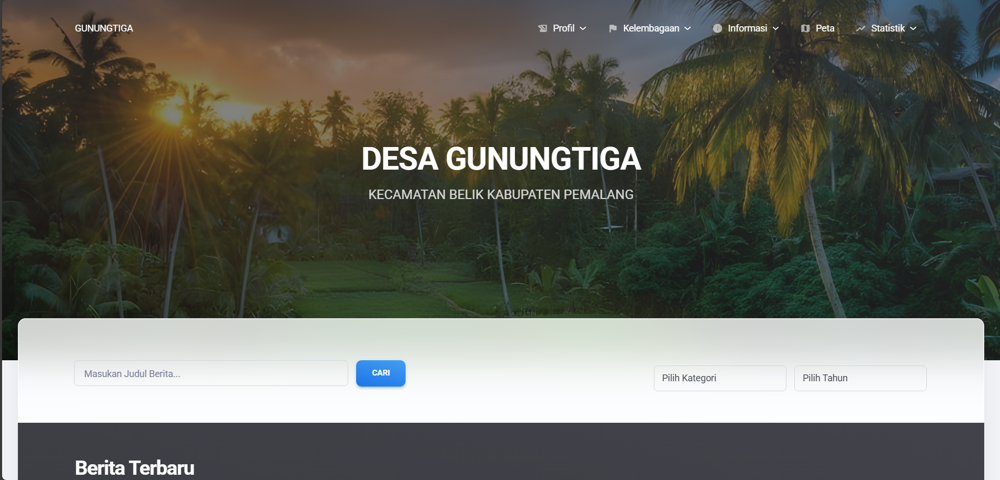

A comprehensive Content Management System (CMS) designed for **Desa Gunungtiga, Belik**. This project reimplements the village's digital presence, focusing on public information transparency and dynamic administrative management.

The system serves two main purposes: providing **public access** to village data and enabling **administrators** to manage content and institutional structures easily.



## ✨ Key Features

### 🌏 Public Portal (Visitor)
Visitors can access all information without logging in:
* **News Portal:** Read the latest village updates uploaded by admins.
* **Village Profile:** View history, vision, and mission.
* **Institutional Structure:** Browse organizational charts for:
    * Village Government (Pemerintah Desa)
    * BPD (Badan Permusyawaratan Desa)
    * LPMD (Lembaga Pemberdayaan Masyarakat Desa)
    * PKK & Karang Taruna
* **Public Data:**
    * **Village Map:** Visual representation of the village area.
    * **Regulations:** Repository of "Peraturan Desa".
    * **Demographic Statistics:** Visual charts showing Population by **Job, Gender, and Education**.

### 🛡️ Admin Dashboard
* **Content Management:** Create, edit, and delete News posts and manage Categories.
* **Dynamic Institutional Management (Drag & Drop):**
    * Manage lists of officials for all institutions (Gov, BPD, LPMD, etc.).
    * **Sort Order Feature:** Implemented **Drag and Drop** functionality using DataTables to easily reorder officials based on hierarchy/rank.
* **Admin Management:**
    * **Verification System:** Approve or verify new admin registrations.
    * **Security:** Update password and account details.

## ⚙️ Technical Highlights

* **Interactive Sorting (Drag & Drop):**
    Unlike standard CRUD tables, the institutional lists allow admins to drag rows to change the display order. This is implemented using **jQuery UI** / **DataTables RowReorder** and synchronized with the database via **AJAX**.
* **Role Management:**
    Secure verification flow where new admins must be approved by existing administrators before accessing the system.

## 🛠️ Built With

* **Backend:** [Laravel](https://laravel.com/)
* **Frontend:** Bootstrap 5, Blade Templates
* **Scripting:** jQuery, AJAX (for Drag & Drop)
* **Database:** MySQL

## 💻 Installation & Setup

1.  **Clone the repository**
    ```bash
    git clone https://github.com/Churma16/gunungtiga-belik/
    cd gunungtiga-belik
    ```

2.  **Install dependencies**
    ```bash
    composer install
    npm install && npm run build
    ```

3.  **Environment Setup**
    ```bash
    cp .env.example .env
    php artisan key:generate
    ```

4.  **Database Configuration**
    Configure your `.env` file:
    ```env
    DB_DATABASE=db_desa_gunungtiga
    DB_USERNAME=root
    DB_PASSWORD=
    ```

5.  **Migrate and Seed**
    ```bash
    php artisan migrate --seed
    ```

6.  **Run the Application**
    ```bash
    php artisan serve
    ```

## 👤 Author

**Fathan Muhammad Faqih**
* [LinkedIn](https://linkedin.com/in/fathan-muhammad-faqih)
* [GitHub](https://github.com/Churma16)
