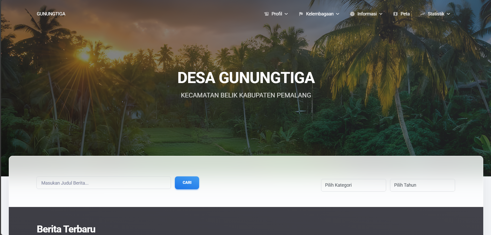

# Village Website Reimplementation (Desa Gunungtiga - Belik)

[](https://laravel.com) [](https://www.php.net/) [](https://www.docker.com/) [](https://opensource.org/licenses/MIT)

Official profile and public information web portal for Gunungtiga Village, Belik District, Pemalang Regency, Central Java. This website is designed to facilitate public access to the latest news updates, institutional structures, demographic statistics, and village regulations and financial reports.

The system serves two main purposes: providing public access to village data and enabling administrators to manage content and institutional structures easily.



---

## Key Features

### Public Portal (Visitor Portal)

Visitors can access all information without logging in:
*   **News Portal**:
    *   Read the latest village updates with pagination.
    *   Integrated news search bar.
    *   Filter news by Category, Author, and Archive time (Year & Month).
    *   Multi-image galleries on the news detail page.
*   **Village Profile**:
    *   Information about Village History, Vision and Mission, and Demographics.
*   **Institutional Structure**:
    *   Organizational charts and official structures for:
        *   Village Government (Pemerintah Desa)
        *   BPD (Badan Permusyawaratan Desa)
        *   LPMD (Lembaga Pemberdayaan Masyarakat Desa)
        *   PKK & Karang Taruna
*   **Public Data**:
    *   **Village Map**: Visual representation of the village area.
    *   **Regulations**: Repository of official village regulations.
    *   **Demographic Statistics**: Visual charts showing population by Gender, Occupation, and Education (based on BIP 2017 data).
*   **Sitemap XML**:
    *   Dynamically generated sitemap (`sitemap.xml`) for Search Engine Optimization (SEO).

### Admin Dashboard (CMS)

*   **Content Management**:
    *   Create, edit, and delete news posts and categories.
    *   WYSIWYG article composition using Trix Editor.
    *   Drag-and-drop multi-image uploads via Dropzone.js.
    *   Automated client-side image compression (Compressor.js) and server-side optimization (Intervention Image) for high performance.
*   **Dynamic Institutional Management**:
    *   Manage lists of officials for all village institutions.
    *   **Sort Order Feature (Drag & Drop)**: Easily reorder officials visually to reflect hierarchy and rank.
*   **Security & Admin Management**:
    *   **Account Verification System**: New admin registrations must be approved and activated by an existing admin before they can log in.
    *   Update user profile (username) and password using secure hashing.

---

## Technical Highlights

### Interactive Sorting (Drag & Drop)

Unlike standard CRUD tables, the institutional lists allow admins to drag rows to change the display order. This is implemented using jQuery UI and DataTables RowReorder, and synchronized with the MySQL database via AJAX requests.

### Verification Workflow

Secure authentication flow where registered users must be activated by an existing administrator before accessing the dashboard.

---

## Tech Stack & Libraries

*   **Backend**: Laravel 10
*   **Frontend**: Bootstrap 5 (styled with Material Kit 2 & Material Dashboard 2 by Creative Tim), Blade Templates
*   **Scripting / Client Libraries**: jQuery, AJAX, SweetAlert2, Dropzone.js, Compressor.js, DataTables
*   **Database**: MySQL
*   **Dockerization**: PHP 8.2 Apache base image, MySQL 8.0, phpMyAdmin

---

## Installation & Setup

You can run this application using Docker (Recommended) or Locally (Manual).

### Method 1: Setup Using Docker (Recommended)

With Docker, you do not need to install PHP, Composer, Node.js, or MySQL locally. All services are containerized.

1.  **Ensure Docker and Docker Compose are installed** on your machine.
2.  **Start the Containers**:
    Run the following command in your terminal from the root directory:
    ```bash
    docker-compose up -d --build
    ```
    *The entrypoint script (docker-entrypoint.sh) will automatically:*
    *   Copy `.env.example` to `.env` if not present.
    *   Install PHP dependencies via Composer.
    *   Generate a new application key (`key:generate`).
    *   Create the storage symlink (`storage:link`).
    *   Wait for the MySQL database to be ready, then run migrations (`migrate --force`).
3.  **Access the Application**:
    *   **Public Portal**: Open [http://localhost:8003](http://localhost:8003) in your browser.
    *   **phpMyAdmin (Database)**: Open [http://localhost:8081](http://localhost:8081) (Username: `root`, Password: *empty*).
4.  **Stop the Containers**:
    ```bash
    docker-compose down
    ```

### Method 2: Local Setup (Manual)

#### Prerequisites

*   PHP >= 8.1 (with `gd`, `fileinfo`, `pdo_mysql`, and `zip` extensions enabled)
*   Composer (PHP dependency manager)
*   MySQL / MariaDB Database Server

#### Installation Steps

1.  **Clone the Repository**:
    ```bash
    git clone https://github.com/Churma16/gunungtiga-belik.git
    cd gunungtiga-belik
    ```

2.  **Install PHP Dependencies**:
    ```bash
    composer install
    ```

3.  **Environment Setup**:
    Copy `.env.example` to `.env`:
    ```bash
    cp .env.example .env
    ```
    Open `.env` and configure your database settings:
    ```env
    DB_CONNECTION=mysql
    DB_HOST=127.0.0.1
    DB_PORT=3306
    DB_DATABASE=db_desa_gunungtiga
    DB_USERNAME=root
    DB_PASSWORD=
    ```

4.  **Generate Application Key**:
    ```bash
    php artisan key:generate
    ```

5.  **Migrate and Seed Database**:
    Make sure a database matching `DB_DATABASE` has been created, then run:
    ```bash
    php artisan migrate --seed
    ```

6.  **Create Storage Link**:
    ```bash
    php artisan storage:link
    ```

7.  **Run the Server**:
    Start the local development server:
    ```bash
    php artisan serve
    ```
    The application will be accessible at `http://127.0.0.1:8000`.

---

## Folder Structure

*   `app/Http/Controllers/` - Contains the application controller classes:
    *   `HomeController.php` - Manages public pages (home, search, profile, sitemap).
    *   `PostController.php` - CRUD operations for news posts.
    *   `AuthController.php` - Authentication, registration, and activation flows.
    *   `VillageGovernmentController.php` (and other institutional controllers) - Handles membership lists.
*   `app/Models/` - Eloquent models (`Post`, `User`, `Category`, `VillageGovernment`, `BPD`, `LPMD`, `PKK`, `KarangTaruna`).
*   `database/migrations/` - Database schemas.
*   `resources/views/` - Blade templates:
    *   `user/` - Public templates (Material Kit 2).
    *   `admin/` - Admin panel views (Material Dashboard 2).
*   `routes/web.php` - Application route declarations.

---

## Security & Authentication

### Route Protection

The dashboard is protected by the `auth` middleware. All write operations on news, categories, and institutional structures require authentication.

### Admin Activation Flow

After a new admin registers via `/register`, their account is inactive by default. An existing admin must approve and activate the user through the `/activate/{user_id}` route before they can log in.

---

## Acknowledgements

Special thanks and appreciation to:

*   **Pemerintah Desa Gunungtiga, Kecamatan Belik**: For the trust, cooperation, and support provided during the handover of this village portal as part of the **Kuliah Kerja Nyata (KKN)** community service program.

---

## Author

**Fathan Muhammad Faqih**
*   [LinkedIn](https://linkedin.com/in/fathan-muhammad-faqih)
*   [GitHub](https://github.com/Churma16)

---

## License

This project is licensed under the [MIT License](LICENSE).
